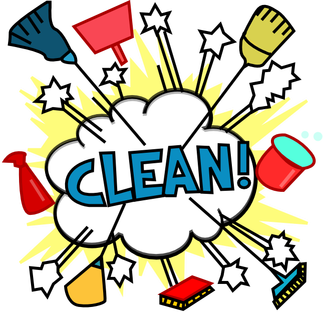

  We've all had the experience of reading somebody else's code and think "how does this possibly work", and that's reality, everyone adapts a different coding standard. For those who are not familiar with coding standards (which I hope you are), they are just specified guidelines and rules that are used in formating source code, pulled from. Coding standards are really effective in making source code look "clean" which is really important for anyone learning a new programming language, or for team developments.
  
  Learning a new language is already hard as it is, but the difficulty factor increases drastically by reading a poorly written source code. This does not only apply to programming languages but for anything else you learn for a first time. Seeing something performed a sloppy way, can easily hinder your growth in that field. Reading poorly written code will lead to confusion while trying to analyze code, and it will take a longer time period in order to process the new material. Then, once you finally understand the code, you will eventually adapt that exact same coding standard. This will ultimately lead to poor coding standards produced by you which you will carry out through your coding career,  just like "monkey see monkey do". This will not be the case if you practice reading good coding standards and change your style as soon as possible. 

  Having "clean" looking code has never been so important than when you're working on a team project / development. How do you expect someone to add to your code when they don't even understand it? It's almost impossible. With good coding standards, your team members will benefit because, they'll be able to spend more time adding and improving your code, than constantly asking you what each line means and becoming frustrated.  This will lead to more productivity and ultimately nicer looking code for anyone else that decides to read it. Adding onto the first claim, with less confusion in your code, your team members will have a much less stressful time finding bugs in your code. Isn't that great, you'll have more helping hands and people won't be discouraged to get a crack at your problem. 

  As to wrap it up, I believe that having good coding standards will help others out, whether it's for beginners or even for people that you work with. It's always best to remind yourself whether someone else will be able to read your code as well as you'
