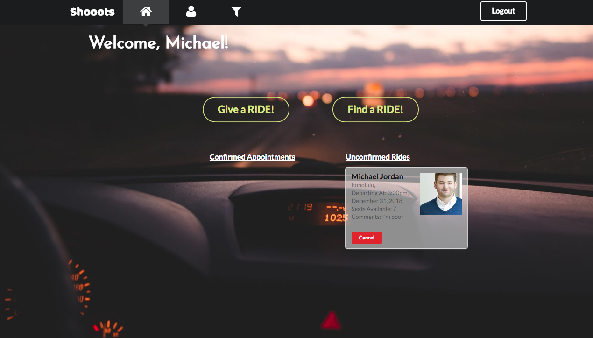

<h2>What is shooots?</h2>
Are you tired of waiting for the bus to commute to school? Wish there was an easier way to catch a ride without calling a taxi? Well that's where the shooots app comes in, an app that solves all your commute problems. The shooots apps was created as our ICS 314 course final project. In a team of three, my groupmates and I wanted to design an application where students are able to carpool with one another to school. The application currently requires a University of Hawaii at Manoa, with plans to make it accessable to the public. 

<h2>Functionality</h2>
When users first access the application, they are prompted to create their profile as a rider or a driver. 
Drivers are allowed to schedule an appointment by the date/time that they are headed to school, and once done, their profile will show up on the filter page along with other fellow drivers.
Riders are allowed to schedule appointments with drivers that are avaliable.

You can read more about the functionality <a href="https://shooots.github.io/#milestone-2-functionality">here</a>.
  

<h2>My role & what I learned</h2>
My role for this application was mainly focused on the UI. I was assigned to desgin the landing-page which is a full background image slider, the home-page, header, footer, and the filter page. The most important thing I learned while doing this project was that communication is really key in developing a web application. There were times where my groupmates and I were lacking in communication and that lead to a lot of confusion of which route we wanted to take with the project. Fortunately towards the end, we were able to fix our communication flaws and practiced using better forms of communication.

Our [Github](https://shooots.github.io) Page

Our [app](https://shooots.meteorapps.com)

 

