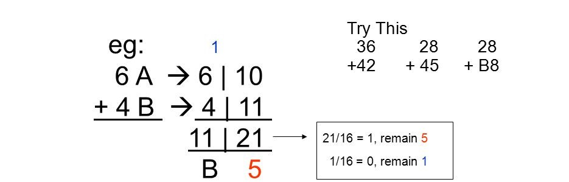

A hexadecimal is a positional numeral system of base 16. It uses 16 distinct symbols, 0 - 9 would be represented as their respected numbers while numbers 10 - 15 would be respresented as A, B, C, D, E, F or as a,b,c,d,e,f. 

For this assignment, we were instructed to develop a program that administered 10 hexadecimal addition problems. Once the user was done answering each and everyone of them, the program would then tell the user which questions they got correct and incorrect, the incorrect answers will then be displayed with the correct answer. 

Source: 

